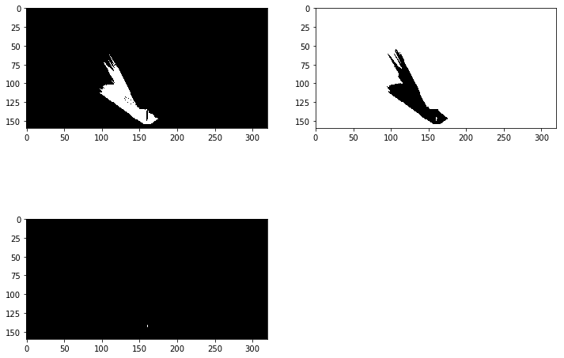
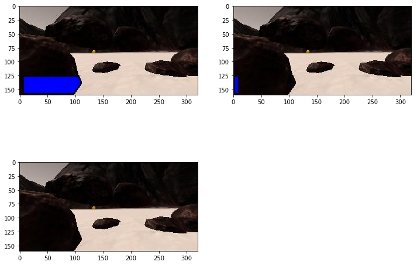

# Resubmission:

For my resubmission I made two modifications to the Perception.py file.

The first modification was to the perception_step method. On line 131 I changed:

```{python, eval=FALSE}
 if Rover.roll > 0.5 or Rover.pitch > 0.5:
```


TO

```{python, eval=FALSE}
 if abs(Rover.roll) > 0.5 or abs(Rover.pitch) > 0.5:
```
Doing so allows the mapping limiter to catch values that are grossly negative for pitch and roll.

The second modification  I made was to the color_thresh method.


```{python, eval=FALSE}
 def color_thresh(img, thresh_type , rgb_thresh=(160, 160, 160),):
    # Create an array of zeros same xy size as img, but single channel
    thresh = np.zeros_like(img[:,:,0])
    
    if thresh_type == "navigation":
        thresh_programmer = (img[:,:,0] > rgb_thresh[0]) \
                & (img[:,:,1] > rgb_thresh[1]) \
                & (img[:,:,2] > rgb_thresh[2])
       
    
    elif thresh_type == "features":
        thresh_programmer = (img[:,:,0] < rgb_thresh[0]) \
                    & (img[:,:,1] < rgb_thresh[1]) \
                    & (img[:,:,2] < rgb_thresh[2])
    
    else:
        thresh_programmer =(img[:,:,0] > 184) \
                & (img[:,:,1] > 164) \
                & (img[:,:,2] < 73)
        
         
    thresh[thresh_programmer] = 1
   
    return thresh
```
These changes will hopefully make the method more versitile by making the map type returned, something that is determined by the input instead of just having one output type.

##Notebook analysis:

  I started off by writing up my Perspective Transform function. With That fuction properly working, I began working on my color_thresh method. 
  
  
  
  I origonally wrote the code to just firgure out the navigation area. 
 
```{python, eval=FALSE}
 above_thresh = (img[:,:,0] > 160) \
                & (img[:,:,1] > 160) \
                & (img[:,:,2] > 160)
```

 I tried messing around with the threshold numbers quite a bit, but I honestly found 160 to be the best fit. 
  
  That figured out, I reversed the thresh to create a map of the Terrian. 
  
```{python, eval=FALSE}
below_thresh = (img[:,:,0] < 160) \
                & (img[:,:,1] < 160) \
                & (img[:,:,2] < 160)
```
  
  I then wrote a thresh that focused on the yellow rocks specifically.
  
  
```{python, eval=FALSE}
stone_thresh =(img[:,:,0] > 184) \
                & (img[:,:,1] > 164) \
                & (img[:,:,2] < 73)
```

 

The colour thresh complete, I then proceeded to complete the rotate pix method and the translate pix method.

```{python, eval=FALSE}
def rotate_pix(xpix, ypix, yaw):
    counter = 0
    yaw_current = yaw[counter]
    counter += 1
    yaw_rad = yaw_current * np.pi / 180    
    xpix_rotated = (xpix * np.cos(yaw_rad)) - (ypix * np.sin(yaw_rad))
    ypix_rotated = (xpix * np.sin(yaw_rad)) + (ypix * np.cos(yaw_rad))
    return xpix_rotated, ypix_rotated

# Define a function to perform a translation
def translate_pix(xpix_rot, ypix_rot, xpos_list, ypos_list, scale): 
    counter = 0
    xpos = xpos_list[counter]
    ypos = ypos_list[counter]
    counter += 1
    xpix_translated = (xpix_rot / scale) + xpos
    ypix_translated = (ypix_rot / scale) + ypos
    return xpix_translated, ypix_translated
```
While completeing the worksheet I encountered a major bug. While the main program drive_rover.python passess yaw and xpos to rotate_pix and translate_pix as single value variable, the worksheet tries to pass the information as a list. This causes the functions to fail in the worksheet. I fixed this problem by introducting an incrementing counter that passed in succsessive values of these lists to the equations of the fuctions as the function was called. 

The next task I did was to setup an image import folder for the Databucket object.I then proceeded to string together and complete all of the above functions into the process_img method.

My final task was to establish an output folder for the movie creation script and to record some IMG files and a robot_log.csv to feed into said script.

see submitted file:

### Autonomous Navigation and Mapping

My first step in completeing the autonomous Navigation section was to finish filling in the Perception file. This was relatively straight forward and involved alot of cutting and pasting from my Jupyter Notebook section. Some variables needed to be redesignated but for, for the most part, the code was the same.

For my decision_step(), step I created 3 scanning mathods that looked for and identified obsticles to the front, right and left respectively.

The below images represent the output of the Front, Left and Right scanning loops respectively. 

The output for the following methods would typically be 

Front = False
Left = False
Right = True

 
 
 To calibrate these scanners I used a number of prepositioned images where I first deterimened whether each method should identify an obsticle or not. Furthermore, The scanners are calibrated to ignore rover tracks and gridlines.
 
For the decision_step it'self I used a decision tree of:

1.Is a Rock near?
      
      - If so stop and pick it up

2. If there is not Rock, ask is the front clear?
      
      - if the front is clear and the rover is at max velocity; steer using the mean of the         Rover nav angles. To increase the fidelity of the scan I limited the turning from          -2 to postive 2
      
      - if the rover is not at maximium velocity, the rover is simply told to speed up.

If the front is not clear, the rover is first told to stop. It then first looks right and then looks left. If either is clear it will turn in place towards the clear direction. In this case the rover will prioritise the right over the left.

If both are blocked, the rover will prioritise turning right until one reads as clear.

Scanning: 

In order to improve scanning, I reduced the rover's top speed to 1 meter per second and had it limit posting map information to the world map, to when pitch and yaw were 0.5 or less. Typically I ran this simulation at 1024 by 1280 and got about 20 frames per second.

#### Results

n general I was able to map 50% of the map with about 70% fidelity. That said, getting those number generally took me about 3 hrs. I tried a number of things to improve fidelity but was unsuccessful. I speculate that shrinking the size of the map sent to the map aspect could possible increase fidelity. There are some obsticles that spelled automatic doom for my rover as the program allowed the rover to drive inside the object; where it would get stuck.
      
      